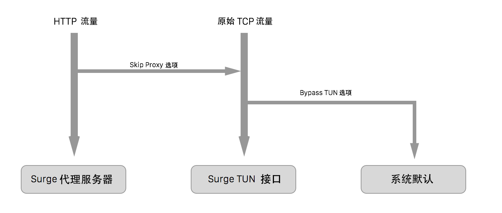

# 组成部分

Surge 包含多个组成部分。

### Surge 代理服务器

Surge 的核心组成部分。Surge 代理服务器是一个高性能高稳定性的全功能 HTTP/SOCKS5 代理服务器。使用 Objective-C 编写，并针对 macOS 和 iOS 优化。

### Surge 虚拟网卡 (Surge VIF)

一些 App 不服从系统代理设置（如 Mail.app），因为它们需要使用原始的 TCP Socket。这种流量可以由 Surge VIF 来处理。

Surge VIF 在 Surge iOS 版本中默认启用。你可以通过开启增强模式来在 Surge Mac 中启用 Surge VIF。

Surge iOS 的架构如下：

### Surge 请求查看器（仅限 Mac 版本）
Surge Dashboard 是一个图形用户界面，用于审查和检查请求，以及列出 DNS 缓存。它可以连接到本地的 Surge 实例，或者连接到配置了 external-controller-access（外部控制器访问）的其他远程实例。
